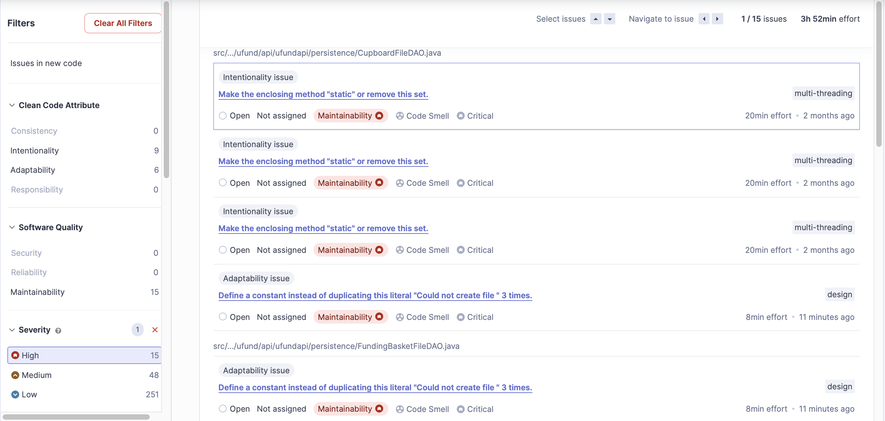

# GuessN'Check Design Documentation

## Team Information
* Team name: GuessN'Check
* Team members
  * Mohammed Fareed
  * Ryan Leifer
  * Kenny Casey
  * Blizzard Finnegan
  * Neav Ziv

## Executive Summary

This is a summary of the project:

### Purpose

The project consists of a web application that allows managers (school administrators) to advertise needs (school supplies) and allows helpers (donors) to fund those needs. The application will allow users (managers) to create a need, and then allow other users (helpers) to fund that need. It will also allow helpers to create a funding basket, which will allow them to fund multiple needs at once. Managers have access to cupboards that holds all their advertised needs. The application also allows helpers to checkout with their baskets, which will allow them to fund all needs in their funding basket.

The project includes a notifications system that allows managers to send notifications to helpers subscribed to a need they have created. The system allows helpers to subscribe to notifications about a need, which managers can push notifications to. The system also allows helpers to view their notifications inbox, clear notifications, and unsubscribe from notifications about a need.

The most important user group is the helpers, as they are the ones that will be using the application the most. The most important user goal is to allow helpers to fund needs. The application will allow helpers to fund needs by allowing them to search for needs and add them to their funding basket. The application will also allow helpers to checkout with their funding basket, which will allow them to fund all needs in their funding basket. The application will also allow helpers to subscribe to notifications about a need, which will allow them to receive updates about the need.

### Glossary and Acronyms

| Term | Definition                        |
| ---- | --------------------------------- |
| SPA  | Single Page                       |
| MVP  | Minimum Viable Product            |
| DAO  | Data Access Object                |
| API  | Application Programming Interface |
| UI   | User Interface                    |
| MVVM | Model-View-ViewModel              |
| OO   | Object Oriented                   |

## Requirements

This section describes the features of the application.

### Definition of MVP

The minimum viable product will allow users to create and fund needs, with minimal authentication. The application should allow user and managers to login, managers to create needs, and helpers to fund needs. The application provides cupboards for managers to advertise their needs, and funding baskets for helpers to checkout and fund multiple needs at once.

### MVP Features

The following are the top-level epics and stories of the MVP:

* **EPIC**: As a User I want to Login so that I can access features/data specific to me.
* **EPIC:** A Manager must be able to manage my needs to maintain and advertise them.
* **EPIC:** As a Helper I want to have a funding basket so that I can organize the needs I want to fulfill.
* As a Helper, I want to checkout with my funding basket to fulfill all needs I have chosen.
* As a Helper I want to be able to search for a need so that I can find specific needs I want to add to my basket.

The MVP features included in this project are: 
* The Funding Basket
* The Cupboard
* User Authentication
* Admin managing of users and needs
* Helper managing of their Funding basket

### Enhancements

Two enhancements were planned but only one was implemented. The first enhancement was to create a notifications system. The system would allow managers to send notifications to helpers subscribed to a need they created. The following are the top-level stories of the implemented enhancement:

* As a Helper I want to subscribe/unsubscribe button when viewing needs so that I can control what needs I receive notifications about.
* As a Manager I want to push a notification regarding a need so that helpers subscribed to the need can see the message.
* As a Helper I want to view my notifications inbox so that I can see all messages in my inbox.

The second enhancement was to create deals on needs. The system would allow managers to create deals on needs, which would allow helpers to fund needs at a discounted price (through donation matching). This enhancement was not implemented due to time constraints. The following were the planned top-level stories of the enhancement:

* As a Helper, I want to see applicable deals to needs I can fund so that I can decide on how much to fund.
* As a Helper I want to be able to check out with a deal so that more needs are donated to the organization.
* As a Manager I want to be able to create deals by clicking a button so that helpers can use them.

Our teams enhancement feature for the project included a notifications system. 
This system includes an ability for a Helper to subscribe to a need, o recieve
relevant notifications. Admins are able to send custom notification messages to 
any Helpers subscribed to the specified need. These notifications are able to be 
closed by helpers if they are no longer needed. Helpers can also unsubscribe from 
needs if they no longer wish to recive notifications.

## Application Domain

This section describes the application domain.

The domain of the application is split into two main sub-domains, the `U-Fund Manager` side and the `Helper` side, which are connected mainly through `Need`s. The `U-Fund Manager` side is responsible for creating and managing needs in `Cupboard`s and specifying `Funding Deal`s on those needs. Managers are also responsible for managing other `User`s as well as their roles.

The `Helper` side is responsible for searching through needs in `Cupboard`s and funding them by grouping them in `Funding Basket`s. Helpers fund the needs in their baskets by going through the `Checkout` process, which applies `Funding Deal`s.

A `Notification Center` is responsible for notifying managers about the fulfillment of their needs and notifying helpers about changes to the needs they are funding (in their baskets). `Helpers` subscribe to notifications about a `Need`, which `Managers` push to this service. The service then notifies all `Helpers` that are subscribed to the `Need` about the new `Message`.

The second 10% feature `Deals` was dropped due to time constraints. The feature would have allowed managers to create deals on needs, which would have allowed helpers to fund needs at a discounted price. The feature would have been implemented by creating a `Deal` class that would be applied to `Need` instances. The `Checkout` class would have applied the `Deal` class to the checkout total, which would have resulted in the `Need` class's funding total being discounted.

## Architecture and Design

This section describes the application architecture.

### Summary

The following Tiers/Layers model shows a high-level view of the webapp's architecture.

The web application, is built using the Model–View–ViewModel (MVVM) architecture pattern.

The Model stores the application data objects including any functionality to provide persistance.

The View is the client-side SPA built with Angular utilizing HTML, CSS and TypeScript. The ViewModel provides RESTful APIs to the client (View) as well as any logic required to manipulate the data objects from the Model.

Both the ViewModel and Model are built using Java and Spring Framework. Details of the components within these tiers are supplied below.

### Overview of User Interface

This section describes the web interface flow; this is how the user views and interacts with the web application.

The UI of the web application is structured such that it provides a unique experience for either helpers, managers, or unregistered users (guests). Guest users can only access the login page or register as a helper.

The top shows the accessible tabs to the user. Managers and access their cupboard and manage users through tabs. Helpers can search needs and manage their funding baskets through tabs. Managers have access to a need editing page when updating or adding needs. Helpers have access to a checkout interface through their funding baskets. Managers have an interface for pushing notifications to helpers subscribed to a need, which is done through their cupboard. Helpers have an interface for viewing their notifications inbox and managing their subscriptions, which is a separate tab only accessible to helpers.

### View Tier

the view tier is responsible for displaying the site to the user. It takes information provided by the ViewModel tier and displays it to the user.
The view tier is made up of component classes that provide the angular implementation as well as HTML/CSS to display the website such as the `add-edit.component.*` files

This tier consists of multiple different directories with multiple files within. Each of these covers a different section of functionality for the admin or the helper.
The `managment` directory contains the add-edit, list, and push components which control multiple important actions for the admin on the site.
There are other components for every other function of the site as well.

The following is a sequence diagram of the view tier for performing the action of adding a need to the funding basket. It shows the flow of information from the view to the view model tier. The diagram shows that the view tier is responsible for displaying the site to the user.

The diagrams shows the flow of the logic within the view tier, and how it connects to the viewModel tier. The View tier uses the logic from the viewModel tier to perform different processes and actions.
The angular logic of the view tier takes information provided by the viewModel tier to create a proper display of said information to the user.

The following is a sequence diagram of the view tier for performing the action of removing a need from the cupboard. It shows the flow of information from the view to the view model tier.

The diagrams shows the flow of the logic within the view tier, which involves propagating the intent to the ViewModel tier (controllers) through an HTTP request. The controller then uses the logic from the viewModel tier to perform different processes and actions, returning a response to the View tier to display to the user through HTTP responses.

### ViewModel Tier

The view model tier is responsible for providing the view with the data it needs. It is also responsible for providing the view with abstraction layer to the logic of manipulating data (business logic), such as the `CupboardController` class's `createNeed()` method. The view model tier is made up of controller classes that provide the view with endpoints that can be queries using HTTP requests to perform tasks or request information.

This tier consists of 4 controller classes, each of which is responsible for a single functionality. The `CupboardController` class is responsible for managing needs in cupboards for managers. The `BasketController` class is responsible for managing funding baskets of helpers, including checking out with the basket. The `NotificationsController` class is responsible for managing notifications, including pushing new notifications and requesting inbox of messages. The `UserController` class is responsible for managing users, including authenticating users and registering new users.

The class diagrams show that the controller classes access DAO classes to handle the logic of the application, which holds the business logic of the application. This allows the controller classes to focus on providing the view with endpoints that can be queries using HTTP requests, while allowing the DAO classes to focus on handling the business logic of the application and models for storing the data.

### Model Tier

The model tier is responsible for storing and managing the data of the application. It is also responsible for providing the data to the view model tier. The model tier is made up data access objects (DAOs) that provide the view model tier with the data it needs. The model tier is also responsible for providing the view model tier with the logic it needs to manipulate the data, such as the `Need` class's `hasBeenMet()` method.

The applications consists of 6 models, used by 4 different file DAOs. The `Need` model represents an advertised need by a manager that needs fulfillment. The `Basket` model represents a collection of needs that a helper wants to fund. A basket does not hold the needs' information directly, but it holds references to needs stored in cupboards using their IDs. This allows the basket to be updated when the needs are updated. This is accomplished by having a single source of truth for the needs, which is the cupboard to which the need belongs.

The `User` model represents a user of the system. It holds the user's credentials and their role. The `User` model is used by the `UsersDAO` to manage users. The `UsersDAO` is responsible for managing users and their roles. It is also responsible for authenticating users and registering new users.

The `Notification` model represents a notification that is sent to helpers subscribed to a need. It holds reference to the need it is about and the message it contains. Notifications are managed through the `NotificationsCenter` model, which is responsible for managing subscriptions and inboxes of user's notifications.

## OO Design Principles

### Single Responsibility Principle

The single responsibility principle has been used by ensuring models, DAOs, controllers, etc. are only responsible for one functionality. This makes the code easier to maintain and test. The principle is applied to the `Need` class. The `Need` class is responsible for storing the data of a need. It is not responsible for any other functionality. The model tier diagram shows that responsibilities beyond data storage, such as manipulating multiple needs in a cupboard, are handled by the `CupboardDAO` class. This allows the `Need` class to focus on its single responsibility of storing the data of a need, while allowing the `CupboardDAO` class to handle the single responsibility of managing multiple needs.

### Controller Design Pattern

The controller design pattern is used by the application to separate the logic of the application from the view. A backend deploys this design pattern by having controller classes that handles requests from the view and provides the view with the data it needs. The controller class has this single responsibility; the business logic is delegated to models. This allows the view to focus on displaying the data and allows the controller to focus on controlling the services of the application, which handle the business logic of the application. The ViewModel Tier class diagrams shows that the controller classes access DAO classes to handle the logic of the application.

This design pattern is applied to the `CupboardController` and `BasketController` classes. The controller design pattern is used to separate the logic of the application from the view. The controller classes are responsible for handling the requests from the view and providing the view with the data it needs. The controller classes are also responsible for handling the logic of the application, such as creating needs and funding baskets. This allows the view to focus on displaying the data and allows the controller to focus on handling the business logic of the application.

### Dependency Injection Design Pattern

Dependency injection is throughout the project through Angular's dependency injection system and Maven's dependency management system. The dependency injection system is used to inject services into components. This allows the components to focus on their single responsibility of displaying data and allows the services to focus on their single responsibility of providing the data. This also allows the components to be easily tested by injecting mock services into them. This is done extensively when testing controllers.

The design pattern is enforced by ensuring that Angular components only depend on services and not other components, delegating responsibility of retrieving data and working with the backend to services. Services have been created for each backend controller, and are injected into the components that need them. Each service is responsible for providing access points to the endpoints of its respective backend controller. For example, the `BasketService` is responsible for providing access points to the `FundingBasketController` endpoints, which is injected into the components that need access to funding baskets, such as the list components of the `BasketModule`.

### Open-Closed Principle

The open-closed principle is used by ensuring that the application is open for extension but closed for modification. This is done by ensuring that the application is modular and that each module is responsible for a single functionality. This allows the application to be extended by adding new modules without modifying existing modules. This is done by ensuring that the application is built using the Model-View-ViewModel architecture pattern. This allows the application to be extended by adding new models, views, and view models without modifying existing models, views, and view models.

This principle is applied to various components of the model tier; the class diagrams show vertically independent paths, showing independence of models from each other. This allows the application to be extended by adding new models without modifying existing models. The class diagrams also show that the models are horizontally dependent on the DAOs, showing that the models are closed for modification but open for extension. This allows the application to be extended by adding new DAOs without modifying existing models.

## Static Code Analysis/Future Design Improvements

### Static Code Analysis

Static code analysis was performed using SonarQube on the Java backend. The following is the results of the analysis.

The results show that the API has a maintainability, reliability, and security rating of A. The results also show that the API has a coverage of 86.1%, which do not match the results obtained using `mvn clean test`; the latter was used as the source of truth for the coverage of the API. The report shows that the API has 0 bugs, 0 vulnerabilities, but 314 code smells. The report also shows no security hot-spots, with 2.5% of the code being duplicated.

The code smells were further analyzed to determine their severity. The following is the results of the analysis.

The results show that the API has 15, 48, 251 code smells of high, medium, and low severity respectively. The results also show that all the issues affect maintainability, with most of them due to intentionality.

The high severity issues were further analyzed to determine their impact on the maintainability of the API. The following is the results of the analysis.

The results show that the API has 15 critical issues, 9 of which are due to intentionality and 6 due to adaptability. The results also show that many of the issues relate to multi-threading and design, which are the result of unfamiliarity with the frameworks.

The Angular frontend was also analyzed using SonarQube. The following is the results of the analysis.

The results show that the UI has a maintainability, reliability, and security rating of A. The results also show that the UI has 0 security hot-spots, bugs, vulnerabilities, code smells, and 0% duplicate code. The results do show a failed overall score due to the lack of coverage, which is expected since the UI is not unit tested.

The code smells were further analyzed to determine their severity. The following is the results of the analysis.

The results show that the UI has 3, 19, 19 code smells of high, medium, and low severity respectively. The results also show that all the issues affect maintainability, with all of them due to intentionality except 4, which are due to consistency (attributed to more individual work during phase 2).

The high severity issues were further analyzed to determine their impact on the maintainability of the UI. The following is the results of the analysis.

The results show that the UI has 3 critical issues, all of which are due to intentionality. The results also show that all the issues are due to bad-practices, which are the result of unfamiliarity with the frameworks.

### Future Design Improvements

The following are future design improvements that the team would explore if the team had additional time:

* The team would explore refactoring the code to improve the maintainability of the code. The team would also explore refactoring the code to improve the testability of the code, including automated frontend testing. This would also include reorganisation of the UI code to be more clearly stored in unique folders, for ease of readability.
* The team would look into resolving both API-level and UI-level issues as listed in Static Code Analysis.
* The team would look into resolving minor UX issues, such as buttons only working if the mouse does not leave the button during activation.
* The team would have liked to redesign the UI to improve the user experience. The team would have liked to improve the UI by adding more features, such as advanced filters for searching needs.
* The team would have liked to implement the second 10% feature, which would have allowed managers to create deals on needs, adding incentives for helpers to fund needs at specific times.

## Testing

### Acceptance Testing

All the user stories have passed their acceptance criteria tests. In total, 23 user stories have been implemented, 14 of which are user facing and included in the testing plan. The acceptance plan shows 40 acceptance criteria tests, all of which have passed. The MVP features and one of the 10% features have been implemented and are bug free. The second 10% feature has been implemented but has not been tested yet. One issue found during acceptance testing that was not resolved is the view not consistently updating upon changes to the model. The issue stemmed from the bug not consistently being present in different environment. This is due to the lack of familiarity with Angular and the frameworks used. The issue was not resolved due to the lack of time.

### Unit Testing and Code Coverage

Unit testing was performed and the results analyzed. The following is the results of the analysis.

The final API shows an average coverage of 92%, which is above the recommended 90%.

#### Controller Tier

This is the analysis at the Controller Tier code for the project.

##### Analysis

The report shows shows an average coverage of 91% for the controller tier, which is above the recommended 90% for the controller tier. Both notifications and users controllers show 100% coverage, while the cupboard and funding basket show 84%. Coverage can be increased for those controllers under 90%, but it is not a priority while the average coverage is about 90%.

#### Model Tier

This is the analysis at the Model Tier code for the project.

##### Analysis

The report shows an average coverage of 98%, which is above the recommended 95% for the model tier. All classes in this tier have a minimum of 95% coverage, with the `Notification` model having the lowest coverage. Further testing in this tier is not a priority while the average coverage is above 95%.

#### Persistence Tier

This is our analysis at the Persistence Tier code for the project.

##### Analysis

The report shows an average coverage of 89%, which is very close to the recommended 90%. The `NotificationsFileDAO` and the `FundingBasketFileDAO` show the lowest coverage, at 78% and 86% respectively. Increasing the coverage of those two classes should increase the tier's coverage to the recommended minimum. The team will focus on increasing the coverage of the `NotificationsFileDAO` and the `FundingBasketFileDAO` to bring up the average coverage of the persistence tier to the recommended 90%.

#### Well-tested Component

This is our analysis of a well-tested component.

##### Analysis

The class report shows that the `Basket` model is one of the best tested classes with a coverage of 100% for both instructions and branches. Since the class belongs to the models tier, maintaining such high coverage will be a priority for the team.
#### Poorly-tested Component

This is our analysis of a poorly-tested component.

##### Analysis

The class report shows that the `NotificationsFileDAO` has one of the lowest class coverage with a coverage of 78%. It belongs to the least tested tier in the project, the persistence tier. The team will focus on increasing the coverage of the `NotificationsFileDAO` to bring up the average coverage of the persistence tier to the recommended 90%. The report shows that the coverage is low due to the lack of testing of `createFile` and `load`, both of which are private methods and are hard to test due to involving file IO operations.
